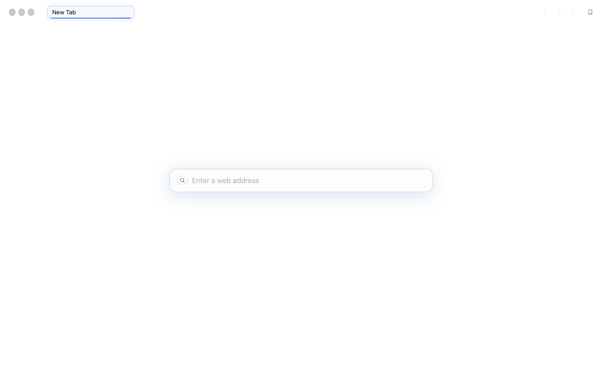
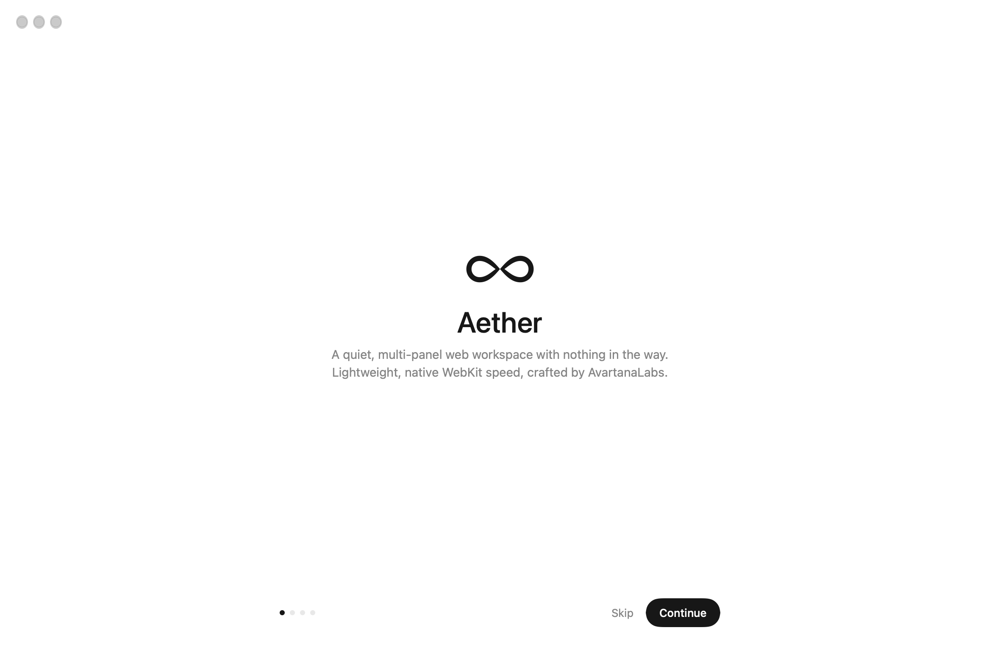
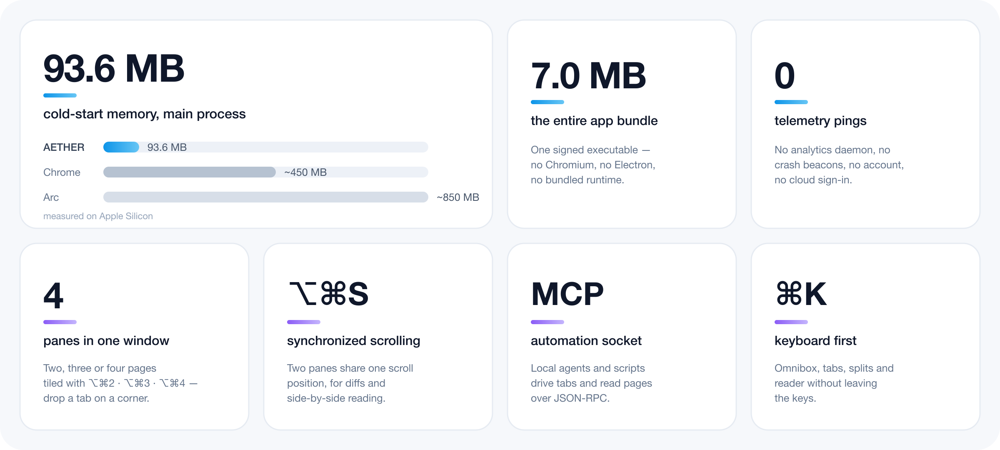
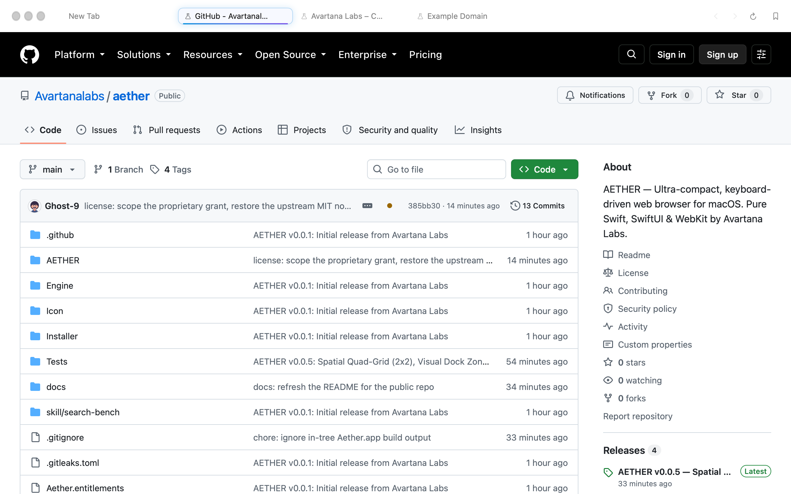
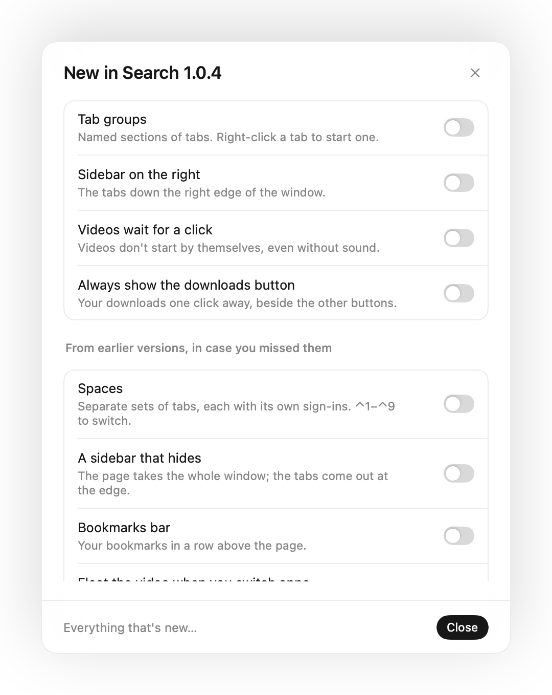

# AETHER

A quiet, keyboard-driven web browser for macOS. Pure Swift, AppKit and WebKit, built by [Avartana Labs](https://avartanalabs.com).

<p align="center">
  
  
</p>
<p align="center"><sub>The starting page, and the first-run onboarding.</sub></p>

<div align="center">

**macOS 14.0+** · **Apple Silicon** · **7.0 MB** · **[Releases](https://github.com/Avartanalabs/aether/releases)** · **[Changelog](CHANGELOG.md)**

</div>

---

## Why AETHER

Most browsers now ship their own rendering engine, updater and metrics pipeline, then keep several background processes alive whether or not you are using the browser. AETHER doesn't. It uses the WebKit that is already on your Mac, which is why the whole application is a single 7 MB executable that starts in about a sixth of a second, and why the main process holds about 94 MB at cold start.

There is no telemetry and no account. Passwords and passkeys stay in the macOS Keychain, ad and tracker rules run inside WebKit before a request leaves the machine, and the only update feed AETHER reads is its own.

## At a glance



## What it does

- **One field for everything** — search, addresses, and local paths such as `/Users/you/notes` or `~/Documents`.
- **Split view and quad grid** — two, three or four pages tiled side by side (`⌥⌘2`, `⌥⌘3`, `⌥⌘4`), with corner drop zones and `⌥⌘S` to scroll a pair together.
- **Tabs that sleep** — background tabs give their memory back after 15 minutes, or sooner under memory pressure, and come back from a snapshot.
- **A local automation socket** — `./bench` speaks JSON-RPC over a Unix socket, so scripts and local agents can open tabs, run JavaScript and take screenshots.
- **Content blocking before the request** — tracker and ad rules are compiled into WebKit rule lists and evaluated before a socket is opened.
- **Element hiding (`⇧⌘H`)**, **Reader mode (`⇧⌘R`)** and **picture-in-picture (`⇧⌘P`)**.
- **Chrome extensions** install from the Chrome Web Store on macOS 15.4 and later. Passkeys use the system sheet.

## Keyboard

| Shortcut | Action | Shortcut | Action |
| :--- | :--- | :--- | :--- |
| `⌘L` | Focus the address field | `⌘T` | New tab |
| `⌘W` | Close tab | `⇧⌘T` | Reopen closed tab |
| `⌘K` | Search tabs | `⇧⌘S` | Show tabs in the sidebar |
| `⌥⌘N` | Split the current page | `⌃⌘←` `⌃⌘→` | Move focus between panes |
| `⌥⌘2` `⌥⌘3` `⌥⌘4` | Two / three / four panes | `⌥⌘S` | Synchronized scrolling |
| `⇧⌘R` | Reader mode | `⇧⌘P` | Picture-in-picture |
| `⇧⌘H` | Hide an element on the page | `⇧⌘J` | Downloads |
| `⌥⌘L` | Passwords | `⌘Y` | History |

## Performance

Measured on this Mac (Apple Silicon, release build):

| Metric | AETHER | Google Chrome | Arc | Safari |
| :--- | ---: | ---: | ---: | ---: |
| App bundle | **7.0 MB** | ~420 MB | ~510 MB | system framework |
| Mach-O binary (`__TEXT`) | **5.58 MB** | ~180 MB | ~195 MB | — |
| Cold start, main process | **93.6 MB** | ~450 MB | ~850 MB | ~140 MB |
| With WebKit XPC processes | **119.4 MB** | ~920 MB | ~1.4 GB | ~280 MB |
| Unit tests | **54 passing** | — | — | — |

## Interface

| | |
| :---: | :---: |
|  |  |
| Tabs in a row | Tabs down the side |
|  |  |
| A page, rendered by WebKit | What's new after an update |

## Building

Requirements: macOS 14 or later with Xcode 16 / Swift 6.

```bash
swift build                     # compile
swift test                      # unit tests
./build.sh                      # sign and assemble build/Aether.app
python3 Tests/split_view.py     # split-view suite (build first)
SEARCH_ARCH=x86_64 ./build.sh   # Intel build, into build/intel
```

## License

Copyright © 2026 Avartana Labs Inc. All rights reserved.

AETHER is proprietary software, © 2026 Avartana Labs Inc. See [LICENSE](LICENSE) for the terms and [THIRD-PARTY-NOTICES.md](THIRD-PARTY-NOTICES.md) for the components it is built on — portions derive from Search, © 2026 Office Commun, under the MIT License. Licensing enquiries: [avartanalabs.com](https://avartanalabs.com) or `licensing@avartanalabs.com`.
